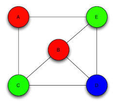

# Bule Tutorial

## What is Bule?

Bule is a tool used to create CNF (conjunctive normal form) encodings for SAT solving.

- SAT (Boolean Satisfiability) is the problem of determining if there exists an assignment of True or False to the variables of a boolean formula.
- A formula consists of 
  - **Variables**: Variables that can either be true or false
  - **Parentheses**: Things in parentheses are evaluated first
  - **Conjunction**: AND operator (`||`)
  - **Disjunction**: OR operator (`&&`)
  - **Negation**: NOT operator (`!`)
- A formula is in CNF if:
  - It is a conjunction of clause(s), where a clause is a disjunction of literals
  - English form: Everything inside the brackets are "OR"ed together, and all the brackets are "AND"ed together
  - Example: `(x1 OR NOT x2) AND (NOT x1 OR x2 OR x3) AND NOT x1` from [Wikipedia](https://en.wikipedia.org/wiki/Boolean_satisfiability_problem#:~:text=clause.%20The%20formula-,(x1%20%E2%88%A8%20%C2%ACx2)%20%E2%88%A7%20(%C2%ACx1%20%E2%88%A8%20x2%20%E2%88%A8%20x3)%20%E2%88%A7%20%C2%ACx1,-is%20in%20conjunctive)

Bule helps you "encode" or "represent" these boolean formulas cleanly.
You can then use a SAT solver to solve these formulas (find an assignment of True or False to the variables s.t. the formula evaluates to True).

It also does more things.

## Formula Representation

Representation of `(x1 OR NOT x2) AND (NOT x1 OR x2 OR x3) AND NOT x1` in Bule: 

```
 x1 | ~x2.
~x1 |  x2 | x3.
~x1.
```
[Bule File](basic.bul)

**Note:**
- Each clause is on a different line, OR is done through `|` and NOT is done through `~`.
- A line ends with a `.` (a bit like a semicolon in most programming languages).
- Formula variables have to be declared with `#exists[0]`
- Lines that begin with `%` are comments

> How many different assignments of Trues and Falses will evaluate to True for this formula (solve manually)?

To solve an formula:
```
bule2 --solve basic.bul
```

To show all models (all assignments that can be True):
```
bule2 --solve --models 0 basic.bul
```

To show the first `x` models
```
bule2 --solve --models x basic.bul
```

## Encoding Problems

If we can represent a problem in CNF form, then we can use SAT solvers to solve for it.

Graph Colouring is a problem where given a graph, find an assignment of colours to each vertex such that adjacent vertices (vertices that are one edge apart) are not the same colour.

Example:



> To represent this in CNF, what would the variables represent?

We want to find an assignment of colours.
Because we are only working with boolean variables, we can only represent if something is something, or is not something.
As a result, we need a variable for each colour-vertex pair).

> To represent this in CNF, what would the clauses be?

We have to determine the rules:

1. Every vertex has to be given a colour.
   - This is enforced through two rules:
     1. Each vertex has to be at least one colour
     2. Each vertex is max one colour
2. Adjacent vertices cannot be the same colour.

> How can we code this up?

[Bule file containing the rules for A and E](graph_colouring_basic.bul).

Running `bule2 --solve --models 0 graph_colouring_basic.bul` should show all valid colour assignments.

Output:
```
Instance ground. Starts solving
SAT
Model 1: ~set_a_blue ~set_a_green  set_a_red ~set_e_blue  set_e_green ~set_e_red
Model 2: ~set_a_blue ~set_a_green  set_a_red  set_e_blue ~set_e_green ~set_e_red
Model 3: ~set_a_blue  set_a_green ~set_a_red ~set_e_blue ~set_e_green  set_e_red
Model 4: ~set_a_blue  set_a_green ~set_a_red  set_e_blue ~set_e_green ~set_e_red
Model 5:  set_a_blue ~set_a_green ~set_a_red ~set_e_blue  set_e_green ~set_e_red
Model 6:  set_a_blue ~set_a_green ~set_a_red ~set_e_blue ~set_e_green  set_e_red
No more models. Total: 6 displayed models out of 6 models.
```

If a variable has a `~` in front of it, it means it is false.
Since we only care about what vertex is what colour, adding / uncommenting the lines

```
#hide ~set_a_blue, ~set_a_green, ~set_a_red.
#hide ~set_e_blue, ~set_e_green, ~set_e_red.
```

will hide those variables from the output if they are false (and if there is no `~` in front of each variable, we will hide the variables from the output if they are true).

The new output looks like this:
```
Instance ground. Starts solving
SAT
Model 1:  set_a_red  set_e_green
Model 2:  set_a_red  set_e_blue
Model 3:  set_a_green  set_e_red
Model 4:  set_a_green  set_e_blue
Model 5:  set_a_blue  set_e_green
Model 6:  set_a_blue  set_e_red
No more models. Total: 6 displayed models out of 6 models.
```


## Grounding

This process gets quite intensive if we were to add more colours, vertices, and edges.
Currently there is a lot of copy and pasting, but using bule we can perform grounding, which is a process of taking a higher level language or representation and then converting it to basic CNF.

1. Rename all instances of `set_<vertex>_<colour>` with `set(<vertex>,<colour>)` in the file, i.e. from `set_a_blue` to `set(a,blue)` (this does not change the behaviour, and only changes the variable name).
2. Note that here, we are looping through all the colours in the clauses, if we were to add a new colour, we would have to do `~set_a_new | ~set_e_new`
    ```
    ~set(a,blue)  | ~set(e,blue).
    ~set(a,green) | ~set(e,green).
    ~set(a,red)   | ~set(e,red).
    ```
   We can declare grounding variables (variables that will not be used in final boolean formula, but will help us "express" the formulas better) at the top of the file.
   ```
   #ground colour[blue].
   #ground colour[green].
   #ground colour[red].
   ```
   Here we are saying we definte the set `colour` which contains `blue`, `green`, and `red`.
   Note that we use square brackets `[]` instead of parenthesis `()`.

   Then we can rewrite the original lines to:
   ```
   colour[C] :: ~set(a,C) | ~set(e,C).
   ```
   which reads as *for C in colour, we have the clause: ~set(a,C) | ~set(e,C)*.
   We can verify this by running
   `bule graph_colouring_basic.bul`, 
   which prints out the grounded output (the result of taking our higher level description into the clauses).
   If we are correct, the output should be the same as our original clauses.
3. 
> Show disjunction and conjunction


We can also ground multiple files.

For example, it may be ideal to have the encoding of vertex colouring in one file and then the encoding of a graph in another.


## Bonus
